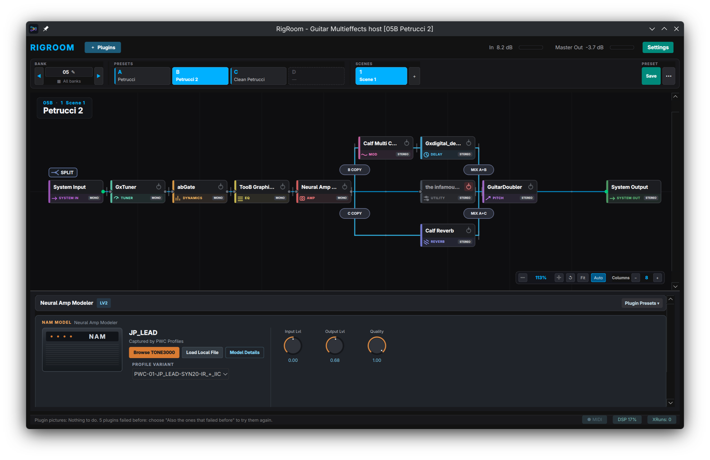
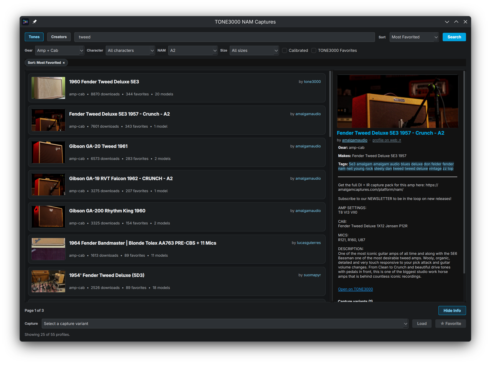

# RigRoom

[](LICENSE)
[](CMakeLists.txt)
[](https://qt.io)
[](https://jackaudio.org)
[](#features)

An open-source guitar and bass multieffects host for Linux: build a rig out of
LV2, VST3 and CLAP plugins, lay it out as a signal path with parallel branches,
and play it from a MIDI footswitch.



---

## Features

### Signal path

- **A board you lay out yourself.** Blocks sit on a grid, and the wire between
  them is the signal. Drag to move, drop between two blocks to insert.
- **Parallel paths.** Drop the `SPLIT` tool into a gap to branch the signal, and
  drag the split or merge handle to change where it separates and rejoins.
  Branches can nest, up to five lanes.
- **Insert anywhere.** A block can be dropped between two others, at either end
  of a path, or on either side of a split or merge. The board makes room by
  itself and the rest of the signal path is left untouched.
- **Per-branch mix, pan and level**, with the wire showing the gain it carries.

### Plugin hosting

- **LV2, VST3 and CLAP**, scanned from the standard folders plus any you add.
- **The plugins' own windows**, embedded in the block's panel, with awkward
  toolkits hosted in their own process so they cannot take RigRoom down.
- **Neural Amp Modeler** captures and impulse responses load straight into a
  block's file slots.
- **Inspector** with knobs, switches and the plugin's own presets.

### Plugin browser


- **Search that keeps up with typing** across name, maker, category, format and
  tags, ranked so the obvious match comes first.
- **Favorites, recently used and categories**; drag a plugin onto the board, or
  keep the browser open beside it.
- **An info panel** with maker, version, licence, description and ports.
- **Plugin pictures** (experimental): RigRoom can photograph each plugin's own
  GUI in the background and show it in the info panel.

### Presets and scenes

- **Banks of four presets** (01A–32D) with named banks and a grid of all of them.
- **Scenes**: up to 8 per preset, storing every block's on/off state and every
  parameter. Switching one reloads nothing, so there is no gap and the blocks
  that stay on keep playing; blocks that switch off fade rather than click. A
  knob can be pinned to stay the same in all scenes.
- **A performance bar** that reads like a floor unit: bank, presets A–D, scenes.

### MIDI control

- **Program Change** selects presets or scenes, with Bank Select for libraries
  past 128 slots.
- **Global CC commands** for previous/next preset, bank up/down, presets A–D and
  scenes, each with Learn.
- **Per-preset Learn** for block on/off and for any parameter, so an expression
  pedal drives what you point it at. A controlled parameter can take over at
  once, or wait until the controller reaches the stored value.

### TONE3000



- **Search captures and impulse responses** from inside RigRoom and load them
  into a block.
- **Browse by creator** and open a creator's profile.

### Audio engine

- Runs on **PipeWire-JACK or JACK**, with the block size, ports and gains chosen
  in Settings.
- **Bypass that does not click**, latency and xrun reporting, and preset and
  scene levels ahead of the master output.

---

## Requirements

RigRoom needs **PipeWire** (with its JACK compatibility layer) or **JACK**.

```bash
# Debian / Ubuntu
sudo apt install -y pipewire-jack
```

Fedora, Arch and Manjaro ship PipeWire-JACK already; check with
`systemctl --user status pipewire`.

## Install

### AppImage

Release AppImages are built against an Ubuntu 22.04 glibc baseline and use the
host's audio server. Verify the download with the `.sha256` file beside it:

```bash
sha256sum --check RigRoom-<version>-x86_64.AppImage.sha256
```

To build one yourself (Docker or Podman is used when available):

```bash
./packaging/build-appimage.sh
```

### From source

```bash
git clone --recurse-submodules https://github.com/toiminimi/RigRoom.git
cd RigRoom
cmake -B build -DCMAKE_BUILD_TYPE=Release
cmake --build build -j$(nproc)
./build/RigRoom
```

Build dependencies:

| Distribution | Packages |
| :--- | :--- |
| Ubuntu / Debian | `build-essential cmake pkg-config qt6-base-dev qt6-base-private-dev libjack-jackd2-dev liblilv-dev libsuil-dev libsecret-1-dev libx11-dev` |
| Arch / Manjaro | `base-devel cmake pkgconf qt6-base lilv suil jack2 libx11 libsecret` |
| Fedora | `gcc-c++ cmake pkgconfig qt6-qtbase-devel lilv-devel suil-devel jack-audio-connection-kit-devel libX11-devel libsecret-devel` |
| openSUSE | `gcc-c++ cmake pkg-config libqt6-qtbase-devel lilv-devel suil-devel libjack-devel libX11-devel libsecret-devel` |

---

## Bugs and feature requests

Report bugs and suggest features in
[GitHub Issues](https://github.com/toiminimi/RigRoom/issues/new/choose).

---

## License and credits

Released under the **GNU General Public License v3.0**. See [LICENSE](LICENSE),
and [CONTRIBUTING.md](CONTRIBUTING.md), [SECURITY.md](SECURITY.md) and
[PRIVACY.md](PRIVACY.md) for project policies.

- **Qt 6** ([LGPLv3](https://www.qt.io/)) — GUI and event loop
- **JACK Audio Connection Kit** ([LGPL](https://jackaudio.org/)) — real-time audio
- **Lilv and Suil** ([ISC](https://drobilla.net/software/lilv)) — LV2 hosting and UI embedding
- **CLAP C API** ([MIT](https://clap.technology/)) — CLever Audio Plugin specification
- **Steinberg VST3 SDK** ([MIT](https://www.steinberg.net/)) — VST3 interface headers

*VST is a registered trademark of Steinberg Media Technologies GmbH.*
